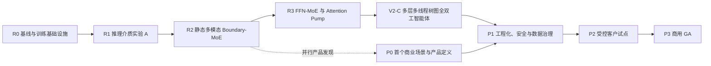

# Project-Yggdrasil V2 从架构验证到商用路线图

日期：2026-08-01

文档地位：V2 总路线图 / 从当前零点到架构完整版与商用版的唯一高层路线

架构真源：`docs/Project-Yggdrasil 多模态潜变量推理架构白皮书 V2.md`

最近执行入口：`docs/next-stage-test-plan.md`

## 1. 路线原则

本路线不按乐观日历承诺推进，而按 Gate 推进。每一阶段都必须回答一个独立问题；没有通过前一 Gate，不启动依赖它的高成本阶段。

总原则如下：

1. 先证明推理介质，再证明静态多模态核心；基础模型架构通过后，才验证多层多线程的系统级智能体；整机通过后才产品化。
2. 模型层实验不同时引入多个无法归因的结构变化；系统级强耦合特性可以进入同一整机实验，但必须用内部 Gate 和消融定位边际价值。
3. 人类主权、权限和不可逆授权是所有阶段的硬约束；目标理解、保持、分解、修正和取消是 V2-C 才验证的行为能力。
4. 代理实验只能产生代理证据；达到 V2 保真合同后才进入 architecture evidence。
5. 正结果要与同基座、同任务和可比计算预算的强基线比较。
6. 失败必须改变路线；不以继续加 step、加 loss、加参数或加 Agent 掩盖结构性失败。
7. 商用 Gate 同时要求用户价值、数据/模型权利、安全、SLO 和单位成本，不以模型演示替代产品完成。

## 2. 总体阶段

阶段编号重新从 V2 路线开始。旧 Stage A—AV-J-C 只作为代理实验历史，不继续推导 AV-J-D。

## 3. R0：基线与训练基础设施

### 目标

建立一套可以公平比较文本 CoT 与连续 latent recurrence 的训练、恢复、计量和证据体系。

### 主要交付

- 选择能稳定完成目标推理任务的最小成熟文本基座；
- 固定文本 CoT、无 CoT 和直接答案基线；
- 统一数据 split、heldout、长度外推和 hard negative；
- checkpoint/resume、配置 manifest、设备/时间/显存记录；
- 统计自回归采样次数、latent transitions、KV/激活、延迟与估算 FLOPs；
- 训练泄漏、答案旁路和 teacher trace 可见性检查；
- 统一 `mechanism-smoke`、`probe`、`formal` 和 `architecture-fidelity` 证据标签。

### Gate R0

同一基座和数据能够稳定复现文本基线；中断恢复、指标和 artifact 完整；成本计量足以进行质量—成本对照。

### 失败处理

若文本基线本身不稳定，先换任务、数据或基座，不实现 latent reasoner。

## 4. R1：推理介质实验 A

### 目标

回答“推理是否需要每一步经过离散词表与线性语法”。

### 主对照

- A0：显式文本思维链；
- A1：单向量 latent recurrence；
- A2：多向量 latent recurrence；
- `K=1/4/8/16` 与 `T=2/4/8/16` 容量—步骤曲线；
- 固定步数与计算匹配两种对照。

### 参考实现

- 冻结成熟文本基座；
- learned latent queries 读取基座 hidden states；
- 复制顶部 2 个 Transformer block 形成独立 recurrent reasoner；
- 第一版 `K=8`、`T=8`、Dense FFN；
- 允许离散/prototype-anchored handle、type、address 与 control sidecar 维持对象持续性，但连续 latent payload 必须完成语义更新；
- 答案头只能读取最终 latent state；
- reasoner 收敛后单独训练自然语言 audit readout。

混合 core 不降低 Gate R1：正式 full-text 输入中的语义角色必须由 Boundary/Reasoner 学得，不能由 oracle span、role tensor、teacher state 或任务专用执行分支注入。全连续寻址可以作为消融，但不是 R1 的必要条件。

### Gate R1

至少一个连续 latent 方案在多 seed、heldout 和长度外推中形成稳定 Pareto 改善：同等质量下总成本更低，或同等成本下质量更高；同时保留成熟文本能力，且 audit readout 通过因果忠实性门禁。

### 失败处理

- 若 A1 失败而 A2 成功，确认单向量瓶颈并继续多向量路线；
- 若只有更大 `K/T` 和更多计算才成功，记录为容量收益，不宣称介质优势；
- 若所有 latent 路径无优势，停止多模态扩展，重做 transition、训练监督或任务设计；
- 不用 FFN-MoE、多模态或更大模型掩盖 R1 失败。

## 5. R2：多模态 Boundary-MoE 实验 B

### 目标

使用 R1 胜出的推理介质，验证异构专家是否能直接在统一 `D_latent` 工作区中融合文本与视觉，随后加入动作。

### 第一部分：文本 + 视觉

- 显式 modality routing；
- 文本与视觉专家内部保持异构；
- 边界投影到统一 `D_latent`；
- 任务必须无法由单模态、模板或语言先验独立完成；
- 对照视觉先语言化、早期拼接和 Boundary-MoE。

### 第二部分：文本 + 视觉 + 动作

- 加入动作状态、动作候选和动作输出专家；
- 明确 READ/REASON/AUDIT/EMIT/STOP；
- 测试动作合法性、视觉事实与文本约束的联合满足；
- 输出专家先显式单选，不做复杂跨词表 arbiter。

### Gate R2

full 相对 `no-text`、`no-image`、`shuffled-image`、缺动作候选和冲突模态具有明确因果差距；Boundary-MoE 相对强早期拼接/语言化基线形成可重复质量或成本收益；潜变量审计与动作保持一致。

### 失败处理

R1 已通过而 R2 失败时，优先归因输入专家、边界投影、Attention Pump、任务设计或训练对齐，不倒推连续推理介质失败。

## 6. R3：FFN-MoE 与 Attention Pump

### 目标

在已经闭合的静态多模态 latent core 上增加内部条件计算和可变长度聚合，但不进入自主工具调用或多节点运行。

### 主要工作

1. 先完成 Boundary-MoE/Dense、普通接口/FFN-MoE 和 Boundary-MoE/FFN-MoE 的 2×2 对照。
2. FFN-MoE 从 4 experts、top-1、约 1.25 capacity factor 起步。
3. 比较 raw concat、pump-only、pump+residual。
4. 所有输入由实验静态提供，输出使用固定 expert；主动 READ/EMIT、真实工具、错误恢复和全双工消息统一留给 V2-C。

### Gate R3

- 两种 router 无严重 collapse，且贡献可分别归因；
- FFN-MoE 在可比 active compute 下提供净收益；
- Pump+residual 建立稳定质量—成本边界；
- 静态文本、视觉和动作表征保持正确因果依赖，不用工具行为冒充模型核心收益。

### 失败处理

若 MoE 只增加参数但没有 active-compute 收益，回退 Dense；若 Pump 没有压缩收益，保留 raw/residual。R3 不以自主调用成败修改已通过的 R1/R2 结论，因为自主调用尚未进入本阶段。

## 7. V2-C：多层、多线程、树图混合全双工智能体

### 目标

把已经通过的模型核心放入一个统一系统实验：以人类目标为根，多层节点按抽象和时间尺度分工，多线程并发推进，树形关系维持责任与授权，受控横向边协调必要事实，所有节点通过独立输入/输出队列连接异构 Boundary experts、必要工具、工作树、记忆/RAG 和外部环境。

V2-C 直接吸收旧 A1-A4 的全部合理目标，不再分别给高保真 I/O、工作树、专家晋升和最终集成授予独立路线地位。其完整任务、节点/消息/工具合同、Flat/Tree-sync/Tree-duplex/Graph-duplex/full 基线、C0-C5 Gate 与停止规则以 [`v2-c-hierarchical-full-duplex-agent-experiment.md`](v2-c-hierarchical-full-duplex-agent-experiment.md) 为准。

### 核心边界

- 人类主权、权限和不可逆授权始终由代码维护；目标理解、保持、分解、修正、取消和歧义处理在本轮验证。
- 局部模态 Boundary expert、系统级运行节点和核心 FFN expert 是三种不同对象，router、状态、成本和权限分别记录。
- 节点共享同版本模型权重但隔离局部状态；树形父子关系定义唯一责任，横向边不能创造目标或扩大权限。
- 全双工表示输入/输出队列和异步事件可并发，不表示单节点无阶段，也不允许不可逆动作绕过批准。
- 工作树、记忆/RAG、来源工件和 provider KV 各守边界；在线经验先成为证据，不能直接成为生产权重。

### 统一 Gate

V2-C 内部按 C0 协议审计、C1 同步正控制、C2 多线程全双工、C3 树图与主动 Boundary、C4 离线能力演化、C5 整机 formal 推进。中间 Gate 只用于构建和归因；只有两类正式任务、三组独立 seed、OOD、故障注入、恢复、权限、人类目标和完整成本全部通过，才能进入 `integrated-system` 证据。

### 失败处理

- Flat 支配目标臂时，保留工具和来源协议，停止层级树图复杂度。
- Tree-duplex 不优于 Tree-sync 时，删除全双工并发。
- 横向边无净收益或增加竞态时，回退纯责任树。
- 人类目标在修正、取消或权限冲突中失守时，停止真实外部动作。
- 动态专家不优于 retrieval/adapter/静态专家时，删除合并分裂机制。

通过 V2-C 后可以称为“Project-Yggdrasil V2 架构完整版”，仍不能直接称为商用产品。

## 8. P0：首个商业场景与产品定义

### 目标

选择一个用户愿意持续付费、且 V2 相对普通多模态模型具有可测优势的首个垂直场景。

P0 不必等到 V2-C 才开始。R2 出现可信多模态正信号后即可并行做访谈、数据回放和工作流原型，避免先完成整套架构再寻找用途；但在 V2-C C5 通过前，不把产品发现结果包装成正式商业能力，也不进入重型生产平台建设。

### 候选选择标准

- 必须依赖文本 + 视觉/文档 + 动作或工具中的至少两类；
- 长任务、按需读取、审计或高保真输出至少一项是核心价值；
- 能定义人工或程序 verifier；
- 能获得合法数据与商业使用权；
- 延迟和成本能进入客户工作流；
- 普通强模型不能以明显更低成本达到同等结果。

### 交付

- 明确用户、工作流、失败成本和购买者；
- 端到端 UX/API 原型；
- 离线客户数据回放评测；
- 质量、节省时间、人工接管率和单位任务成本基线；
- 明确不做的市场和能力。

### Gate P0

至少有一个场景在真实数据回放中形成可量化价值和可接受风险；否则继续产品发现，不进入多租户平台建设。

## 9. P1：工程化、安全与数据治理

### 目标

把研究系统改造成可以承载真实客户数据和生产流量的平台。

### 主要工作流

| 工作流 | 必须闭合的内容 |
| --- | --- |
| Serving | 模型/专家加载、调度、缓存、批处理、弹性、降级、fallback |
| 版本治理 | model/expert/prompt/schema manifest、灰度、canary、回滚 |
| 数据治理 | 租户隔离、加密、保留、删除、导出、备份和地域边界 |
| 安全 | prompt injection、恶意媒体、工具越权、供应链、密钥和审计 |
| 可观测性 | trace、READ/EMIT、router、成本、来源、恢复和错误分类 |
| 质量 | 固定回归、客户回放、OOD、红队和人工复核 |
| 产品 | API/SDK、UI、管理员策略、审批、人类接管和反馈 |
| 运营 | SLO、告警、事故响应、支持、容量和成本预算 |

### Gate P1

生产候选版本通过安全评审、数据治理验收、故障恢复和压测；不存在自动训练后直接进入生产的路径。

## 10. P2：受控客户试点

### 目标

在少量真实客户和受控范围内验证价值、风险、成本与运营能力。

### 试点方式

- 默认 human-in-the-loop；
- 限定工具、数据域、输出范围和不可逆动作；
- 对高风险任务强制 audit readout 与来源检查；
- 记录模型建议、人工修改、失败、恢复和最终业务结果；
- 版本固定，升级经过 canary；
- 客户可见数据保留与删除规则。

### Gate P2

- 目标质量和人工接管率达到场景门槛；
- 单任务毛利路径成立；
- 严重安全/数据事故为零；
- 客户愿意续用或付费；
- 支持和事故响应成本可控。

若价值不成立，应回到 P0 改场景，而不是用更大模型硬撑错误产品定位。

## 11. P3：商用 GA

### 目标

形成可公开销售、持续运营、可升级和可支持的正式版本。

### GA 门槛

- 商业许可、数据权利、隐私条款和客户合同完整；
- 质量、可用性、延迟、吞吐和单位成本 SLO 达标；
- 多租户、计费、管理员控制、审计和删除闭环；
- 生产模型与专家可版本化、灰度、回滚；
- 固定安全评测、红队和真实反馈回归；
- local/cloud/hybrid 中至少一种部署形态成熟；
- 文档、SDK/API、UI、支持、状态页和事故流程可用；
- 不把未验证模态或自主行为包装成正式能力。

商用 GA 不是路线终点。之后仍按“真实任务提案—隔离训练—独立评测—授权灰度—回滚”的方式增加专家和能力。

## 12. 规模与资源演进

| 阶段 | 主要规模目标 | 资源策略 |
| --- | --- | --- |
| R0-R1 | 最小成熟文本基座 + 小型 latent reasoner | 本机优先，冻结基座，控制变量 |
| R2-R3 | 文本/视觉/动作专家 + 小型 FFN-MoE | 预训练专家、缓存特征、必要时工作站或云 GPU |
| V2-C C0-C4 | 协议、全双工并发、树图协作、工具闭环与隔离专家演化 | 先用确定性模拟器和小规模任务归因；多卡/集群只按瓶颈证据扩张 |
| V2-C C5 | 两类完整版正式任务 | 独立训练、评测与 serving 环境；权限、故障与恢复注入齐全 |
| P0-P2 | 产品候选与试点 | 成本建模、容量上限、客户隔离和可回滚发布 |
| P3 | 商用 GA | 弹性 serving、SLO、成本治理和运营冗余 |

参数量和训练 token 不是阶段完成指标。只有更大规模能解决已经定位的容量问题时才升级资源。

## 13. 证据晋升

| 路线阶段 | 最高可声明证据 |
| --- | --- |
| R0 | baseline / infrastructure |
| R1 | architecture-fidelity for reasoning medium |
| R2-R3 | architecture-formal for multimodal core |
| V2-C C0-C4 | system-component formal；只用于构建与归因 |
| V2-C C5 | integrated-system |
| P0-P1 | product candidate |
| P2 | commercial-pilot |
| P3 | commercial-ga |

任何阶段不得借后续愿景提高当前证据等级。

## 14. 直接收口规则

以下旧路线不再作为下一阶段：

- AV-J-D 及继续修补 AV-J 系列 record reward；
- 以结构化 object/cell/count slot 作为目标潜空间必须采用的内部本体；
- 单阶段从零 Micro-Omni 作为目标架构正式验证；
- Attention Pump 作为唯一信息通道；
- 内部宪法自评分后直接固化生产权重；
- 工作树节点 drop 等于 provider KV 无损回收；
- 把主动 READ/EMIT、真实工具执行或人类目标保持塞回 V2-B/R3 的静态模型核实验；
- 把高保真 I/O、工作树、异步节点、专家晋升和整机评测继续拆成旧 A1-A4 并行路线；
- 只以 loss、cosine、pixel MSE、answer accuracy 或模型自述判定成功。

旧 artifact 和报告只保留为历史证据。后续实现、测试和计划若继续锁旧契约，应删除或按 V2 直接重写，不建立兼容 wrapper。

## 15. 当前最近动作

当前只执行 R0 与 R1：

1. 冻结成熟文本基座候选与任务；
2. 建文本 CoT/直接答案基线；
3. 实现独立 recurrent latent reasoner；
4. 完成 `K/T` 容量—步骤曲线；
5. 训练并验证自然语言 audit readout；
6. R1 通过后才启动 R2 文本 + 视觉。

R2/R3 通过后不再分叉到旧 A1-A4，而是按同一合同进入 V2-C C0；在此前只允许完善 V2-C 任务、协议、基线和 Gate，不实现运行时、不接真实工具、不训练系统。

具体命令、文件与通过门槛由 `docs/next-stage-test-plan.md` 维护。
