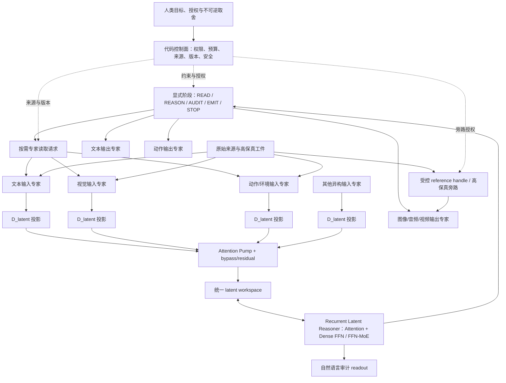

# Project-Yggdrasil 多模态潜变量推理架构白皮书 V2

文档地位：Target Architecture / 本测试仓库当前唯一目标架构白皮书

版本：V2.0

日期：2026-07-11

上位真源：`C:\skzy\QuickFileTransport\世界树计划\docs\architecture\design-philosophy-and-cognitive-principles.md`

替代关系：本文直接替代 `docs/Project-Yggdrasil 未来多模态潜空间智能体架构.md` 的当前规范地位。V1 只保留为历史思想来源，不再作为实现或评测依据。

证据状态：目标架构尚未完成高保真实现。本文中的效益判断均为可证伪假设，不能由现有 AV 系列代理实验自动证明或证伪。

## 1. 摘要

Project-Yggdrasil V2 研究一个基础问题：推理状态是否必须在每一步都经过“词表 logits、离散 token、线性语法和 token 回嵌”，还是可以由一个或一组连续潜向量直接递归更新。

V2 的目标不是取消文本能力。成熟文本模型仍然提供语义、知识和推理起点；文本 encoder、审计 readout 和输出 decoder 继续存在。变化在于：主推理循环不再被迫持续生成表面语言，而是在统一宽度的连续潜变量工作区中更新状态，需要审计或输出时才转换为自然语言。

为了让该推理核心直接处理多模态，V2 同时采用两层互不冲突的专家体系：

- **Boundary-MoE** 位于输入和输出边界，允许文本、视觉、动作、音频、视频和其他专家拥有不同 tokenizer、内部宽度、token 数、空间结构和候选表，只在进入潜变量核心时投影到统一 `D_latent`。
- **FFN-MoE** 位于潜变量 Transformer 单元内部，为统一 latent token 提供稀疏条件计算和更大的参数容量。

系统以“连续语义、离散控制”为基本分工：推理内容由连续 latent 表达；读取、输出、停止、专家选择、权限和预算等具有外部后果的动作由显式控制 token 和代码不变量管理。

## 2. 设计陈述与权威边界

本文遵循世界树主哲学规定的四类设计陈述：

| 类型 | 本文中的含义 |
| --- | --- |
| 宪法原则 | 人类主权、安全、事实完整性、权限、来源和在线身份稳定，不由训练收益覆盖 |
| 架构承诺 | V2 已选择的组件边界、数据流、可见性、控制面和升级方式 |
| 可证伪假设 | 连续潜变量推理、Boundary-MoE、FFN-MoE、Attention Pump 等是否提高质量或成本效率 |
| 参考实现 | 为第一轮高保真实验冻结的具体结构和默认参数，不自动成为永久架构定律 |

人类定义合法目的、价值边界、授权和不可逆取舍；潜变量模型负责开放语义、判断与规划；代码基座维护来源、版本、权限、预算、安全和可恢复性，不替模型裁定事实真假。

V2 是模型与运行层的下位架构。它不能吞并世界树的宪法身份、记忆树、工作树、原始来源和正式工件，也不能静默创造第二套主体权责。

## 3. 根命题

### 3.1 推理介质命题

传统显式文本思维链通常形成如下递归：

```text
hidden state
-> vocabulary logits
-> 选择离散 token id
-> token embedding
-> 下一步 hidden state
```

V2 的连续潜变量递归为：

```text
H_t ∈ R^(K × D_latent)
-> latent transition
-> H_(t+1) ∈ R^(K × D_latent)
```

`K` 可以为 1，也可以是一组并行向量。V2 不预设单向量足够；单向量和多向量状态必须通过容量—成本曲线比较。

核心可证伪假设是：在保持成熟文本语义能力和按需可审计性的前提下，连续 latent recurrence 能减少强制离散语言化造成的自回归、KV 和模态往返成本，并形成稳定的质量—成本优势。

### 3.2 多模态命题

文本不是所有外部状态的天然最佳中介。视觉空间、动作轨迹、连续传感状态和高熵生成目标若反复转成线性语言，可能损失并行结构和精度。

V2 不因此宣称自然语言无用。它验证的是：不同模态能否先由各自专家形成潜变量表示，在统一 `D_latent` 工作区中直接参与推理，仅在控制、审计和外部表达时使用离散 token。

### 3.3 可审计命题

主推理不持续写字，不代表推理可以完全不可读。V2 要求决策相关的 latent trajectory 能按需读取为自然语言思维链，并通过删除、打乱和干预等因果测试验证 readout 忠实性。

自然语言 readout 是审计接口，不是事实真值。事实仍由来源、外部结果、方法、交叉验证和反证决定。

## 4. 总体架构



这张图表达三个不变量：

1. 潜变量核心默认通过 latent 和来源元数据理解世界，不直接拥有全部原始数据。
2. 输入与输出专家不能绕过核心形成不可见的自主闭环。
3. 高保真复制、编辑和续写可以使用核心授权的 reference handle，不强迫所有像素或细节穿过小型 latent 瓶颈。

## 5. 成熟文本基座与潜变量核心

### 5.1 成熟基座的地位

成熟文本基座不是最终被淘汰的旧模块。它提供：

- 语言语义、世界知识和组合推理的初始化；
- 文本任务的教师行为与基线；
- 输入上下文的初始 hidden states；
- 自然语言审计和最终文本输出能力。

V2 降低的是表面文本生成在主推理循环中的支配地位，不是删除由文本训练形成的语义能力。

### 5.2 Recurrent Latent Reasoner

参考实现采用独立 recurrent block：

1. 成熟文本基座先编码输入一次。
2. `K` 个 learned latent queries 读取冻结基座的 hidden states。
3. 从基座高层复制少量 Transformer block，形成权重独立的 latent reasoner。
4. 同一组 reasoner block 递归运行 `T` 步，更新 `H_1...H_T`。
5. 主答案或动作头只能读取最终 latent state，不允许绕过潜变量核心直读原输入或 teacher trace。

这种结构兼顾语义继承和实验归因：它不要求随机模块重新学习全部推理，也不在每个 latent step 运行完整成熟基座。

### 5.3 第一版参考参数

| 项目 | 起始选择 | 地位 |
| --- | --- | --- |
| `D_latent` | 等于成熟基座 residual width | 参考实现 |
| latent queries | learned queries cross-attend 基座 hidden states | 参考实现 |
| recurrent block | 复制基座顶部 2 个 Transformer block，权重独立 | 参考实现 |
| `K` | 先固定 8，再扫 `1/4/8/16` | 实验变量 |
| `T` | 先固定 8，再扫 `2/4/8/16` | 实验变量 |
| 停止 | 第一版固定 `T`；后续再训练 stop head | 直接切换顺序 |
| 基座训练 | 第一阶段完全冻结，第二阶段仅顶部 LoRA，最后短程联合 | 训练合同 |

动态 `K`、动态停止和全量基座解冻不能进入第一轮实验，否则介质、容量、计算量和模型重训练无法归因。

## 6. Boundary-MoE 与 FFN-MoE

### 6.1 Boundary-MoE

Boundary-MoE 路由的是外部表征与表达能力：

- 专家内部模型宽度、层数、tokenizer、token 数、空间布局和候选词表可以不同；
- 专家输出 token 数 `N_expert` 可以不同；
- 进入 latent workspace 的每个 token 宽度必须统一为 `D_latent`；
- 第一版按显式 modality/type 元数据路由；同模态多专家后续才使用 preview encoder 或最小公共 embedding 做语义路由。

“拒绝异构转换器”在 V2 中被收窄为：拒绝潜变量推理链内部反复切换互不兼容的 latent 宽度；不禁止边界专家内部异构，也不禁止它们投影到统一 `D_latent`。

### 6.2 FFN-MoE

FFN-MoE 路由的是潜变量 Transformer 内部计算：每个 latent token 在 residual stream 宽度不变的前提下选择不同 FFN expert。

第一版多模态实验使用 4 个 FFN experts、top-1 routing 和约 1.25 的容量因子作为起点。所有专家由同一个 dense FFN 复制并加入极小扰动；router 从近似均匀状态开始，使用轻量负载均衡与 router 稳定损失。

Boundary router 与 FFN router 必须分离：前者回答“由谁理解或表达外部信息”，后者回答“当前 latent token 使用哪套内部参数计算”。它们使用不同日志、负载指标、消融和升级流程。

### 6.3 两层 MoE 的验证方式

多模态实验必须保留 2×2 对照：

| 外部接口 | 核心 FFN | 用途 |
| --- | --- | --- |
| 普通统一接口/早期拼接 | Dense | 最小基线 |
| Boundary-MoE | Dense | 判断异构边界本身的作用 |
| 普通统一接口 | FFN-MoE | 判断内部条件计算的作用 |
| Boundary-MoE | FFN-MoE | 目标组合 |

只有组合相对各单项产生可重复净收益，才能宣称两层 MoE 具有协同价值。

## 7. Attention Pump 与高保真通道

Attention Pump 处理相同 `D_latent`、不同 `N_expert` 的专家输出。V2 保留它，但废止按 `route_weight × expert_length` 计算输出长度的旧公式。

正式合同为：

- Pump 输出长度 `K_pump` 由独立计算预算或阶段控制器决定；
- route weight 可以成为 attention bias，不直接等于 token 配额；
- 控制约束、来源标识和必要高保真 token 可走 bypass；
- 第一轮必须比较 raw concat、pump-only 和 pump+residual；
- 只有 reconstruction、因果消融和最终任务同时通过后，某条专家通道才允许只走 Pump。

Attention Pump 是主聚合候选，不是不可绕过的唯一证据管道。

## 8. 可见性与专家调用

### 8.1 四条信息通道

| 通道 | 内容 | 主要载体 |
| --- | --- | --- |
| 推理通道 | 判断、查询意图、工作状态和输出意图 | 连续 latent |
| 控制通道 | 读取、输出、停止、专家选择、预算和权限 | 特殊离散 token / 结构化事件 |
| 证据通道 | 原始图像、文本、音频、文件和环境状态 | 输入专家与独立来源工件 |
| 高保真参考通道 | 复制、保持、编辑或续写所需的源细节 | 核心授权的 reference handle / bypass |

V2 不把所有内容都潜变量化。需要审计和权限控制的外部动作保持离散；需要高带宽表达的语义内容使用连续 latent。

### 8.2 可见性矩阵

| 组件 | 默认可见 | 默认不可见 |
| --- | --- | --- |
| 输入专家 | 本模态原始数据、query latent、source handle、区域/预算、本专家局部缓存 | 完整全局 workspace、其他专家内部状态、标准答案 |
| 潜变量核心 | 返回的 latent、来源/覆盖/不确定性、调用历史、专家索引和预算 | 原始字节、全部专家内部 hidden state |
| 输出专家 | intent latent、输出模式、格式/预算/权限、授权 reference handle | 完整 workspace、未授权原始输入、其他专家内部状态 |
| FFN expert | 当前层的 latent residual token | 原始外部数据、Boundary 权限、任意工具或输出动作 |

### 8.3 显式调用

核心用离散控制事件携带连续参数：

```text
<READ_EXPERT expert=vision source=image_17 budget=16>
query_latents[Kq, D_latent]
```

输入专家返回：

```text
ReadResult
- evidence_latents
- source_ref
- coverage
- uncertainty
- continuation_handle
```

输出调用为：

```text
<EMIT expert=text mode=final_answer>
intent_latents[Ko, D_latent]
reference_handles[]
constraints
```

输出专家若缺少信息，只能返回结构化的 `NEED_MORE_REFERENCE`；它不能自行调用输入专家。所有跨边界调用仍由潜变量核心与代码控制面批准。

### 8.4 防止过度分离

V2 通过三种机制避免专家成为互相失明的孤岛：

1. 每个输入模态先提供少量全局 latent，让核心知道来源大致包含什么。
2. 核心可以按需发起局部、高分辨率或换专家重读。
3. 高保真生成和编辑可以授权输入来源直接向输出专家提供 reference handle，但推理决定仍必须来自 intent latent。

原始数据归输入专家，语义判断归潜变量核心，物理表达归输出专家；跨边界通过可审计控制事件显式授权。

## 9. 显式运行阶段

V2 使用显式状态，而不是期望 MoE gate 自然学出“思考或输出”：

```text
READ -> REASON -> 可选 AUDIT -> EMIT -> STOP
```

- `READ` 允许输入专家写入 latent workspace；
- `REASON` 只更新潜变量状态，不产生表面文本；
- `AUDIT` 按需把实际 latent trajectory 转成自然语言；
- `EMIT` 选择输出专家并执行外部表达或动作；
- `STOP` 明确结束当前模型回合。

阶段可以循环，例如工具或环境结果返回后重新 `READ -> REASON`。任何物理 I/O、权限变化和不可逆动作都必须经过代码控制面，不由 latent router 暗中触发。

## 10. 自然语言思维链审计

### 10.1 训练顺序

1. 先训练 latent reasoner 完成任务。
2. 冻结或大部分冻结 reasoner。
3. 训练独立 audit decoder 读取 `H_1...H_T` 并生成自然语言思维链。
4. 只有 readout 明显不足时，才以低权重进行短程联合训练。

该顺序避免 audit loss 把整个潜空间重新逼成文本空间。

### 10.2 忠实性门禁

审计 decoder 不能看到标准答案。至少必须验证：

- 打乱、删除或替换关键 latent step 会同步改变思维链和最终结果；
- 思维链中的关键判断能预测后续 latent state、动作或答案；
- 对思维链表达的关键判断做受控干预，会引起方向一致的 latent 或行为变化；
- `no-latent`、`shuffled-latent`、错误来源和冲突模态产生显著下降；
- 自然语言 readout 中的事实、来源和不确定性接受外部 verifier 检查。

可读性只在抽检、调试、高风险任务和离线评测时支付成本，不重新污染普通潜变量推理主线。

## 11. 输出专家

第一版使用显式单输出专家：文本任务只调用文本输出，动作任务只调用动作输出。这样避免跨词表 logits 校准成为潜变量介质实验的额外变量。

完整版可以支持多专家同时提交候选，但必须定义：

- 全局候选类型和命名空间；
- 重复候选去重；
- 跨专家温度与置信校准；
- 权限、合法性和资源约束；
- 无合法候选时的回退；
- 独立 arbiter 或显式阶段控制器的最终责任。

高保真图像、视频或音频输出接收三类输入：`intent_latents`、授权 `reference_handles` 和不可违反的 `constraints`。

## 12. 训练与能力保持

### 12.1 基座训练顺序

1. **冻结阶段：**完全冻结成熟文本基座，只训练 latent queries、recurrent reasoner、答案头和必要 adapter。
2. **局部适配：**latent 路径稳定后，只给基座顶部少量层加入 LoRA，学习率显著低于 latent 模块。
3. **短程联合：**混入原始文本任务 replay，检查语义、语言和普通推理能力保持。

第一版不全量解冻基座。若全量解冻后任务提高，将无法判断收益来自潜变量结构还是模型被重新训练。

### 12.2 专家调用训练

主动调用按以下顺序训练：

1. 静态输入：专家先提供全部受控 latent，验证基础融合。
2. 教师指定调用：训练核心生成正确的 READ/EMIT 控制事件。
3. 自主调用：删除调用标签，只保留任务结果、证据和成本。
4. 预算与错误恢复：加入无效调用、空结果、冲突证据、专家超时和第二次精读。

在线模型不能通过任务经验直接修改身份、宪法或生产权重。

### 12.3 离线新增专家

完整版允许离线固化 Boundary expert 或 FFN expert：

```text
能力缺口与真实任务证据
-> 隔离训练候选专家
-> 边界合同、heldout 与安全回归
-> 与旧系统独立比较
-> 有权人类批准
-> 版本化灰度启用
-> 持续门禁与可回滚
```

内部宪法可以提供约束检查，但不能单独定义事实真值、批准自身升级或绕过人类授权。

## 13. 工作树、记忆树与后续运行层

潜变量 workspace 是当前激活面，不是完整任务状态或长期知识库。

- 工作树保存任务目标、全局不变量、分支、证据入口、风险和恢复位置；
- 记忆树保存跨任务知识、经验、来源和能力入口；
- 原始来源与正式工件独立保存；
- 潜变量核心按当前工作缺口读取必要切片。

完整版将工作树的按需展开推广到模型运行层：核心可通过 READ 控制事件主动选择来源、区域、分辨率和专家。工作树负责语义状态与恢复，provider KV 管理负责物理缓存；二者不得再被视为同一棵树。

任何 KV 释放都只表示取消激活。若后续状态依赖被删除 KV，必须重算或从工作树恢复，不能宣称指针 drop 天然无损。

## 14. 渐进生成与资源自适应

渐进生成保留为完整版扩展，但推理深度、读取精度和渲染质量不再强制正比。

系统分别管理：

- 感知与主动读取预算；
- latent reasoning step 与 `K` 预算；
- verifier 与审计预算；
- 图像、视频、音频或文本输出预算。

低资源状态可以减少装饰、分辨率、采样步或任务范围，但不能降低安全、权限、事实声明和不可逆动作的最低证据要求。

## 15. 架构完整版与商用版定义

### 15.1 架构完整版

达到“架构完整版”至少需要：

1. 连续 latent recurrence 在同基座对照中形成可重复质量—成本优势。
2. 文本、视觉和动作 Boundary experts 在同一 `D_latent` 工作区中形成因果闭环。
3. Boundary-MoE 与 FFN-MoE 分别可归因，组合稳定且无严重 router collapse。
4. Attention Pump、bypass 和高保真 reference channel 形成明确质量—成本边界。
5. READ/REASON/AUDIT/EMIT/STOP 可自主切换并能恢复错误调用。
6. 自然语言 readout 通过因果忠实性门禁。
7. 工作树、记忆树、来源和任务恢复接入运行层。
8. 至少一种生成输出专家与一种动作专家通过正式任务验证。
9. 离线专家训练、独立评测、授权晋升和回滚闭环可运行。

完整版是研究与工程架构完成，不等于商业产品完成。

### 15.2 商用版

商用版在完整版之上增加：

- 明确的首个垂直产品与用户价值，不以“通用智能”作为唯一卖点；
- 模型、数据、专家和训练集的许可证及商业使用权；
- 用户数据隔离、加密、保留、删除、导出和审计；
- prompt injection、恶意文件、越权工具和供应链安全防护；
- 多租户权限、组织策略、管理员控制和人工审批；
- 版本化模型/专家 manifest、灰度发布、canary、回滚和事故响应；
- 端到端可观测性、调用链、成本归因、审计 readout 和恢复记录；
- 延迟、可用性、吞吐、质量和单任务成本 SLO；
- local/cloud/hybrid 部署、SDK/API、产品 UI、计费和客户支持；
- 固定回归集、真实用户反馈闭环与禁止自动晋升生产权重。

商业门槛不是“模型能生成结果”，而是用户在可接受成本和风险下持续获得可验证价值。

## 16. 可证伪假设与失败解释

| 假设 | 必须比较什么 | 失败时说明什么 |
| --- | --- | --- |
| H1 连续 latent 优于逐步离散语言化 | 同基座、同数据、同任务、计算匹配的文本 CoT vs 单/多向量 recurrence | 当前 latent transition、容量或训练路线无优势；不能直接否定所有潜变量推理 |
| H2 多向量优于单向量 | `K=1/4/8/16` 的质量—成本曲线 | 单向量是瓶颈，或任务不需要更大状态 |
| H3 Boundary-MoE 提高多模态融合 | 普通接口 vs Boundary-MoE，保留 no/shuffled modality | 异构边界未产生净收益，或专家/任务设计不足 |
| H4 FFN-MoE 提高条件计算能力 | Dense vs FFN-MoE，同 active compute | router、专家分工或规模不足；不能由参数总量掩盖 |
| H5 Attention Pump 提供有效压缩 | raw、pump-only、pump+residual 的重建、任务和成本 | Pump 失真或预算不足，应保留更多高保真 token |
| H6 自主专家调用降低总成本 | 静态全读 vs 主动 READ，同质量下的调用与延迟 | query policy、索引或成本设计失败 |
| H7 audit readout 忠实 | latent 干预、删除、打乱与行为一致性 | readout 只是事后合理化，不能作为安全证据 |
| H8 离线专家晋升提高长期表现 | 新旧版本独立任务、安全回归和真实用户指标 | 候选专家不应晋升，旧版继续服务 |

短期流畅、单次成功、latent cosine、loss 或模型自述都不是架构成立证据。

## 17. 证据等级

| 等级 | 含义 |
| --- | --- |
| mechanism-smoke | 接口、前后向、checkpoint 或数据管线能运行 |
| surrogate-probe | 妥协代理任务上的单次方向信号 |
| surrogate-formal | 受控代理任务按既定 seed 和门槛完成，但未达到目标架构保真 |
| architecture-fidelity | 成熟基座、连续 recurrence、无旁路、审计和专家边界均符合 V2 合同 |
| architecture-formal | 高保真实现通过多 seed、OOD、消融和同预算强基线 |
| integrated-system | 完整 Agent、工作树/记忆树、恢复、主动调用和输出闭环 |
| commercial-pilot | 真实客户、真实数据边界、SLO、安全和成本进入受控试点 |
| commercial-ga | 商业发布、运营、支持、升级和合规闭环成立 |

现有 AV 系列最多属于前三类。后续文档不得把代理 formal 自动改写成 architecture formal。

## 18. V1 处理结论

| V1 命题 | V2 结论 |
| --- | --- |
| 大脑与 I/O 外设解耦 | 保留；成熟文本语义能力不随表面文本模块退化 |
| 全系统统一维度 | 收窄为潜变量 token 表统一 `D_latent`；边界专家内部保持异构 |
| 级联主动采样 | 保留为完整版主动 READ 扩展，不是当前介质实验门槛 |
| 低熵摘要 + URI | 改为来源工件、content/version metadata、coverage 和可继续读取 handle |
| 逻辑树绑定 KV 并无损 drop | 撤销；工作树与物理 KV 分离，依赖状态需要重算或恢复 |
| 内部宪法自评并固化 LoRA | 否决；改为独立评测、人类授权、灰度和回滚 |
| Attention Pump | 保留；输出长度由预算决定，并保留 bypass/residual |
| 思考与 I/O 概率 1 互斥 | 改为显式 READ/REASON/AUDIT/EMIT/STOP |
| 树深正比去噪与质量 | 撤销严格正比；各类预算分别控制 |

V2 不提供兼容别名或双轨解释。任何实现、测试和计划若锁定 V1 已撤销语义，应直接删除或按 V2 重写。

## 19. 最终定义

Project-Yggdrasil V2 是：

> 一个由成熟文本推理能力初始化和监督、使用一个或一组连续潜向量递归更新推理状态而不在每一步经过离散词表采样、通过 Boundary-MoE 接入异构文本/视觉/动作及其他专家、在核心内部可叠加 FFN-MoE 条件计算、以显式控制事件管理读取与输出、能按需忠实读取为自然语言思维链，并在工作树、记忆树、来源、权限和离线授权升级约束下运行的多模态推理系统。

其研究价值取决于是否在真实、同预算对照中证明更好的质量—成本与多模态能力；其商业价值取决于是否把这种能力变成安全、可恢复、可运营、可负担且有明确用户价值的产品。
