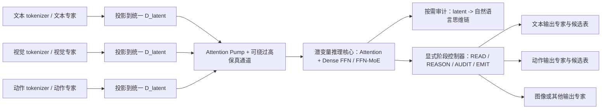

# Project-Yggdrasil 潜变量推理核心架构审阅

日期：2026-07-11

审阅对象：`docs/Project-Yggdrasil 未来多模态潜空间智能体架构.md`

上位设计真源：`C:\skzy\QuickFileTransport\世界树计划\docs\architecture\design-philosophy-and-cognitive-principles.md`

文档地位：V2 决策形成记录 / 非当前规范。正式架构真源已经切换到 `docs/Project-Yggdrasil 多模态潜变量推理架构白皮书 V2.md`；本文件只保留推导与审阅依据，不与 V2 并行定义架构。

## 结论

当前项目需要分开回答两个递进问题：

1. **推理介质问题：**推理状态是否应该在每一步都经过离散词表与线性语法，还是可以直接用一个或一组连续向量递归更新？
2. **多模态范围问题：**如果连续潜向量推理成立，它能否通过异构专家直接融合文本、视觉和动作，并扩大模型可处理任务的范围？

这两个问题不能继续混在一轮实验里。第一部分先排除多模态感知和路由干扰，只比较离散 token 回路与连续 latent 回路；第二部分再使用第一部分胜出的推理介质验证多模态融合。这样才能判断失败来自推理介质，还是来自专家接口与模态对齐。

白皮书的 MoE 不是当前主流 Transformer 单元内部的稀疏 FFN-MoE，而是位于输入与输出边界的异构专家体系：每个专家可以拥有自己的 tokenizer、输入结构、内部宽度、token 数量和候选表，只在进入潜变量推理 token 表时对齐到统一维度。本文称其为 **Boundary-MoE（异构边界专家体系）**。Boundary-MoE 与块内 FFN-MoE 解决不同问题，彼此不冲突；目标架构可以同时使用二者。

原审阅中“统一维度必须配套 object、cell、count、relation 等预置语义类型”的判断过度设计，现予撤回。成熟语言模型也没有在架构中硬编码这些本体；目标潜空间的语义应主要通过成熟文本能力监督、跨模态任务和翻译训练形成。结构化 slot 可以继续作为代理实验的脚手架和诊断工具，但不是目标架构的硬要求。

## 一、当前主线与暂不处理的扩展

### 1.1 当前主线

当前研究主线直接拆成两部分实验：

1. **实验 A——推理介质。**用成熟文本能力监督连续 latent recurrence，对照显式文本思维链，判断推理是否需要反复离散化和语言化；同时比较单向量与多向量 latent state。
2. **实验 B——多模态与双层 MoE。**使用实验 A 的胜出推理介质，先融合文本与视觉，再加入动作；Boundary-MoE 负责异构输入/输出，FFN-MoE 负责潜变量核心内部的条件计算。

两部分都要求潜变量过程能够按需、忠实地读取为自然语言思维链，但审计 readout 不参与日常主推理回路。

### 1.2 暂不作为当前成立性门槛

以下内容保留为后续扩展，不应混入第一轮“潜变量推理是否成立”的判断：

- 级联主动采样；
- 渐进式生成与资源自适应输出；
- 工作树推广到模型内部运行层；
- 工作树与真实 provider KV 生命周期的联动；
- 长期记忆树、跨任务恢复和开放式 Agent；
- 离线新增专家、长期自我演化与自动路由治理。

这些扩展仍受世界树设计哲学约束，但当前实验不因尚未实现它们而失败，也不能因实现了某个简化版本就宣称完整架构成立。

## 二、核心假设：为什么从文本推理转向潜变量推理

原始直觉是合理的，但需要先把“token”和“向量”区分准确。Transformer 内部的 token 表征本来就是向量；真正需要研究的是，推理递归的每一步是否必须经过下面这条离散化回路：

```text
hidden state
-> vocabulary logits
-> 采样/选择离散 token id
-> token embedding
-> 下一步 hidden state
```

连续潜变量推理改为：

```text
latent state H_t ∈ R^(K × D_latent)
-> latent transition / Transformer block
-> latent state H_(t+1) ∈ R^(K × D_latent)
```

这里的 `K` 可以等于 1，也可以是一组并行向量。后一种方案避免把“取消离散 token”又误做成“每步只有一个连续向量”的新瓶颈。

文本思维链把内部状态反复投影为离散词表和顺序语法，可能带来三类成本：

1. **自回归书写成本。** 每个可见 reasoning token 都增加生成步数、KV 长度和后续注意力范围；其中一部分计算用于组织可读句子，而不是更新任务状态。
2. **离散语言瓶颈。** 视觉空间关系、连续状态和动作轨迹必须反复翻译成线性文本，可能丢失并行结构、精度或非语言细节。
3. **模态往返成本。** 如果视觉先转成文本、文本完成推理、结果再转回动作或图像，系统会多次经过语言接口；潜变量工作区可能减少这些往返。

但这些只是研究假设。文本也提供了成熟的组合结构、训练监督、自我检查和可解释性；潜变量循环如果步数更多、状态更宽或需要昂贵 decoder，未必比文本更省。成立性必须通过同基座、同任务、同数据和尽量同计算预算的对照来证明，不能只比较 token 数或单次 loss。

建议把第一部分主假设冻结为：

> 在保持成熟文本语义能力和按需可审计性的前提下，连续 latent recurrence 不经过逐步词表采样和 token 回嵌，能够在纯推理任务上形成相对于显式文本思维链的质量—成本优势；多向量 latent state 是否优于单向量 state 由容量曲线决定。

第二部分再单独验证：

> 使用同一连续 latent recurrence 时，Boundary-MoE 是否能比强制语言化或普通早期拼接更好地保留和融合异构模态；在此基础上，块内 FFN-MoE 是否能增加条件计算容量而不破坏统一潜空间。

## 三、Boundary-MoE 与块内 FFN-MoE 的双层组合

### 3.1 目标拓扑



这里允许不同形状的专家分工：

- 专家内部 `d_model`、层数、tokenizer、token 数、空间布局和词表可以不同；
- 专家输出的 token 数 `N_expert` 可以不同；
- 只有送入潜变量推理表的每个 token 宽度 `D_latent` 必须统一；
- 潜变量 reasoner 处理统一宽度、可变长度和带 mask 的 token 序列；
- 输出专家可以有不同候选空间，但候选合并必须经过显式命名空间和分数校准。

因此，“拒绝异构转换器”应重写为：**拒绝在潜变量推理链内部反复截断并切换互不兼容的 latent 宽度；不禁止输入/输出专家使用异构内部结构，也不禁止它们在边界投影到统一 `D_latent`。**

### 3.2 两种 MoE 彼此正交

Boundary-MoE 与 FFN-MoE 的作用层级不同：

| 机制 | 路由对象 | 主要作用 | 必须统一什么 |
| --- | --- | --- | --- |
| Boundary-MoE | 输入/输出模态、tokenizer、encoder、decoder 和候选表 | 允许不同形状的外部专家接入同一推理核心 | 进入核心的 `D_latent` 与边界合同 |
| FFN-MoE | Transformer 单元内部每个 latent token 的 FFN 计算路径 | 在相同潜空间内提供稀疏条件计算和更大参数容量 | Transformer residual stream 的宽度 |

组合数据流是：

```text
异构输入
-> Boundary-MoE 编码与 D_latent 投影
-> Attention / latent recurrence
-> 块内 FFN-MoE 条件计算
-> 继续 latent recurrence
-> Boundary-MoE 输出专家与候选表
```

两种 MoE 可以同时存在，但必须使用不同 router、不同负载均衡指标和不同消融。Boundary router 选“由谁理解或表达外部信息”，FFN router 选“当前 latent token 使用哪组内部参数计算”；不能用一个 gate 同时承担二者。

### 3.3 两类边界路由不能混在一起

输入 token 尚未转成向量时，路由器可用的信息有限：

- 如果路由只按模态选择文本、视觉、动作专家，应使用显式 modality/type 元数据；这不需要模型猜测。
- 如果要在同一模态中按语义选择不同专家，原始 token ID 通常不足以决定路由，需要一个便宜的 preview encoder，或在最小公共 embedding 之后再路由。

因此，Boundary-MoE 可以在“主编码之前分离”，但不能假定复杂语义路由在完全没有向量表征时自然成立。

### 3.4 输出候选表合并是独立合同

不同专家的 logits 不天然可比较。不同词表大小、温度、训练数据和任务先验会让简单拼接或取最大值产生偏置。v2 必须在以下两种方案中选定一种：

1. 显式阶段控制器先选定一个输出专家，只在该专家的候选表内采样；
2. 多专家同时给出带全局类型与命名空间的候选，由独立 arbiter 做校准、约束和最终选择。

“在最终 token 候选表位置合并”方向可保留，但必须定义候选身份、重复候选去重、跨专家温度校准、不可比较候选和无合法候选时的行为。

### 3.5 离线固化新专家

Boundary-MoE 确实为离线新增专家提供了较清晰的扩展面：冻结成熟基座和潜变量核心，训练新专家、边界投影与必要路由，再通过独立评测加入生产系统。但它不能恢复为旧白皮书中的内部宪法自评分：

```text
经验或能力缺口
-> 隔离训练候选专家
-> 验证 D_latent / 候选表合同
-> 独立任务与安全回归
-> 人类授权
-> 版本化启用与可回滚
```

新专家可以固化，自动自批则不成立。

## 四、统一维度与语义形成

### 4.1 对旧审阅的修正

“共享维度不等于共享语义”在逻辑上仍然成立，但它不构成要求手工设计 object、cell、count、relation 的理由。统一维度的职责只是建立可共同计算的物理接口；语义是否形成属于训练问题。

目标架构不预置通用语义本体。语义主要通过以下信号形成：

- 成熟文本模型的推理能力与 teacher 行为；
- 文本、视觉或动作对同一任务状态的联合监督；
- 外部任务结果和因果消融；
- latent 与自然语言思维链之间的按需可读训练；
- 必要时的重建、对比、循环一致性或状态预测辅助目标。

结构化 object/cell/count/relation slots 可以在小规模实验中帮助定位问题，但它们属于可观测脚手架，不应被写成目标模型必须采用的内部语言。

### 4.2 真正需要显式保留的结构

系统只需要在专家与潜变量核心的边界显式保存：

- modality / expert identity；
- token boundary、shape、mask 与位置/时间坐标；
- source reference 与 producer/adapter version；
- 当前任务、分支和生命周期；
- 是否允许被压缩、丢弃、持久化或用于外部动作。

这些是控制和可追溯元数据，不是对潜变量内容的手工语义标注。潜变量核心内部的普通隐藏状态仍可保持连续、涌现和不可逐维解释。

## 五、Attention Pump 与显式运行阶段

### 5.1 Attention Pump 保留，但修正输出长度合同

Attention Pump 仍是 Boundary-MoE 中处理可变长度专家输出的重要候选。旧公式 `ceil(sum(route_weight * expert_length))` 没有充分依据，并把“专家使用权重”与“所需信息容量”混为一谈。

建议改成：

- Pump 接受相同 `D_latent`、不同 `N_expert` 的 token；
- 输出长度 `K` 由独立的计算预算或阶段控制器决定，不由路由权重直接计算；
- route weight 可以作为 attention bias 或专家先验，不直接等于 token 配额；
- Pump 之外保留可绕过的 raw/residual 高保真通道；
- 只有通过 reconstruction、因果消融和最终任务对照后，某一专家输出才允许只走 Pump。

Attention Pump 是主聚合器，但不是不可绕过的唯一信息管道。

### 5.2 思考与 I/O 切换必须显式处理

思考和 I/O 不应继续依赖 MoE gate 恰好输出概率 1。运行时至少需要显式阶段：

```text
READ -> REASON -> 可选 AUDIT -> EMIT
```

- `READ` 允许输入专家写入潜变量表；
- `REASON` 只更新潜变量状态，不生成表面文本；
- `AUDIT` 按需调用自然语言思维链 readout；
- `EMIT` 选择输出专家并生成外部动作或内容。

阶段之间可以循环，例如工具结果返回后重新 `READ -> REASON`，但每一步的物理 I/O 边界必须明确。

## 六、潜变量必须可读为自然语言思维链

上一版只要求审计来源、状态变化和动作结果，约束不足。当前正式要求改为：**潜变量推理的决策相关过程必须能够按需读取为自然语言思维链。**

这项要求不意味着主推理过程同步写字，也不要求把每个视觉细节或每个隐藏维度无损翻译成语言。它要求审计 decoder 能从实际潜状态序列中，逐步说明模型读取了什么、形成了什么中间判断、如何更新状态以及为什么选择最终动作。

单独训练一个会生成漂亮解释的 decoder 不足以证明可读性，因为它可能事后合理化。至少需要以下忠实性门禁：

1. 审计 decoder 只能读取潜状态、阶段记录和允许的来源引用，不能直接看到标准答案。
2. 打乱、删除或替换关键 latent step 时，思维链和最终结果应发生对应变化。
3. 思维链中的关键判断应能预测后续 latent 状态、动作或答案，而不只是复述问题。
4. 对思维链表达的关键判断做受控干预时，应能观察到方向一致的 latent 或行为变化。
5. `no-latent`、`shuffled-latent`、错误来源和冲突模态必须暴露明显差距。
6. 自然语言 readout 的事实、来源和不确定性必须接受外部结果与 verifier 检查；可读思维链不能成为系统自证正确的唯一依据。

可审计性会带来额外训练和推理成本，但该成本只在抽检、调试、高风险任务或离线评测时支付，不应重新污染日常潜变量推理主线。

## 七、逐命题处理结论

| 白皮书命题 | 当前判断 | 处理方式 |
| --- | --- | --- |
| 推理核心与文本、图像、视频输出解耦 | 保留 | 成熟文本语义能力用于初始化和监督潜变量核心；文本表面生成降为 teacher、审计器和输出外设，不让语义能力随文本模块退化 |
| 全局固定维度、拒绝异构转换 | 收窄后保留 | 只统一潜变量推理 token 表的 `D_latent`；专家内部形状可异构；拒绝推理链内部频繁切换不兼容 latent 宽度 |
| 级联主动采样与低熵摘要 | 后续扩展 | 不进入当前潜变量推理成立性门槛；未来从工作树的按需展开推广到模型运行层 |
| 逻辑树绑定 KV Cache 并无损 drop | 原推导撤销 | 工作树与物理 KV 管理拆成两个系统；drop 前序 KV 会使依赖它的后续状态失效 |
| 内部宪法自评分并固化 LoRA | 当前形式否决 | 允许离线训练和固化新专家，但必须独立评测、人类授权、版本化启用和回滚 |
| Boundary-MoE 输出经 Attention Pump 聚合 | 保留并重写 | 保留不同形状专家、统一 `D_latent` 和 Pump；修正输出长度，增加可绕过高保真通道与候选表校准 |
| 潜变量核心叠加块内 FFN-MoE | 新增兼容机制 | 与 Boundary-MoE 正交；前者负责内部条件计算，后者负责异构边界，在实验 B 中用 2×2 对照单独归因 |
| 思考与 I/O 绝对互斥 | 改为显式控制 | 用 READ / REASON / AUDIT / EMIT 阶段控制，不依赖概率门控自然形成 |
| 树深、去噪步数和输出细节正比 | 保留资源自适应方向 | 当前不验证；未来把推理预算、读取预算和渲染预算分别控制，不要求严格正比 |

## 八、与世界树设计哲学的关系

潜变量核心主要属于“当前上下文/当前激活面”的内部实现，不替代世界树的记忆树、工作树、来源工件、权限或身份层。

- 人类定义目的和不可逆取舍；潜变量模型不能自行创造终极目标。
- 成熟文本模型提供语义与推理起点，但在线训练不能让身份、宪法和事实标准漂移。
- Boundary-MoE 路由权重只表示当前专家使用倾向，不表示事实可信度或长期价值。
- 自然语言思维链 readout 提高审计能力，但事实仍由来源、外部结果、方法和反证决定。
- 工作树、主动采样、KV 管理和离线专家演化属于以后与模型核心联动的层，不应提前混入第一轮训练结论。

因此，世界树哲学不否定纯潜变量推理；它要求潜变量推理保持人类授权、来源可追溯、状态可恢复、按需可审计和离线升级受控。

## 九、两部分高保真实验

### 9.1 实验 A：推理是否应该经过离散词表

实验 A 只研究推理介质，不引入视觉、Boundary-MoE 或 FFN-MoE。成熟文本基座、任务数据、答案输出头和训练预算尽量保持一致，只改变中间推理回路。

至少比较三种路径：

| 路径 | 中间递归状态 | 目的 |
| --- | --- | --- |
| A0 显式文本思维链 | 每步 `hidden -> vocab -> token id -> embedding` | 当前主流基线 |
| A1 单向量 latent recurrence | 每步直接传递 `H_t ∈ R^(1 × D_latent)` | 判断取消离散化本身是否有价值 |
| A2 多向量 latent recurrence | 每步传递 `H_t ∈ R^(K × D_latent)`，对 `K` 做容量曲线 | 判断单向量是否构成新的信息瓶颈 |

三条路径最终使用相同的答案或动作输出合同。A1/A2 在主推理期间不能采样隐藏文本 token；自然语言思维链只由独立审计 decoder 按需读取。

任务必须确实需要多步状态更新，并包含 heldout 组合或长度外推，避免模型只靠问题到答案的直接映射。建议同时设置：

- 同等训练样本与相同成熟基座；
- 固定推理步数对照，以及计算量匹配对照；
- `K=1/2/4/8/...` 的 latent 容量—成本曲线；
- 禁止 answer head 直读原始输入的严格瓶颈版本；
- `no-latent`、`shuffled-step`、截短 latent trajectory 和 step intervention；
- 按需自然语言思维链的忠实性门禁。

实验 A 的主指标不是“latent token 更少”，而是：

- 最终任务质量和 OOD/长度泛化；
- 自回归采样次数、latent transition 次数和总 wall-clock latency；
- KV/激活峰值、估算 FLOPs 与训练成本；
- 同等质量下成本，或同等成本下质量；
- 成熟文本能力保持；
- 自然语言 readout 对实际 latent trajectory 的因果忠实性。

只有 A1 或 A2 相对 A0 形成稳定的质量—成本优势，才能说“推理不必在每一步投影成离散词表与线性语法”获得了正证据。若 A2 只靠更大 `K` 和更多计算获胜，应记录为容量收益，不能包装成介质优势。

### 9.2 实验 B：多模态融合与 Boundary-MoE + FFN-MoE

实验 B 使用实验 A 中表现最好的推理介质，首先做文本 + 视觉，随后在同一实验线加入动作。它同时验证使用范围和双层 MoE，但必须用消融分开二者贡献。

建议采用 2×2 主对照：

| 外部接口 | 潜变量核心 | 回答的问题 |
| --- | --- | --- |
| 普通统一 tokenizer/早期拼接 | Dense FFN | 最小直接基线 |
| Boundary-MoE | Dense FFN | 不同形状专家与边界投影本身是否有价值 |
| 普通统一接口 | FFN-MoE | 块内条件计算本身是否有价值 |
| Boundary-MoE | FFN-MoE | 两种 MoE 组合后的目标候选 |

第一阶段使用文本目标与视觉事实，任务必须无法由文本模板或视觉单模态独立解决。第二阶段加入动作状态或动作候选，形成文本 + 视觉 + 动作三模态闭环。

实验 B 必须报告：

- `no-text`、`no-image`、`shuffled-image`、冲突文本/图像与缺动作候选消融；
- Boundary router 与 FFN router 各自的使用分布、负载和塌缩；
- Attention Pump、bypass/residual 和无 Pump 的保真对照；
- 各专家到统一 `D_latent` 后的信息保持和跨模态任务质量；
- Dense 与 FFN-MoE 的质量—参数—激活计算量差异；
- 输出候选表合法性、校准与自然语言审计一致性。

实验 A 与 B 的因果关系必须保持清楚：A 成立而 B 失败，说明多模态接口、路由或训练仍有问题；A 不成立时，B 即使在某个任务上成功，也只能证明多模态模型可训练，不能证明“取消离散语言推理”是收益来源。

只有两部分都闭合后，才有理由把主动采样、工作树运行层、渐进生成或离线新增专家接回主线。

## 十、架构保真门槛

实验结果要上升为“目标潜变量推理架构证据”，至少必须满足：

1. 使用成熟文本语义能力作为初始化或 teacher，而不是仅从零训练一个小型代理模型。
2. 实验 A 的连续 latent 路径在中间推理步不能采样隐藏文本 token；必须与离散 token 回路做同基座对照。
3. 同时测试单向量与多向量 latent state，并把 `K`、step 数和总计算量显式报告，不能把单纯扩容写成介质优势。
4. 主答案或动作路径不能绕过潜变量核心直读输入、teacher trace 或标准答案；潜变量核心必须执行真实多步状态更新。
5. 自然语言思维链 readout 来自实际 latent trajectory，并通过删除、打乱和干预忠实性门禁。
6. 实验 B 的异构专家只在边界统一 `D_latent`，专家内部允许异构；Boundary router 与 FFN router 必须分别记录和消融。
7. Boundary-MoE、FFN-MoE、二者组合和 dense/普通接口基线必须形成可归因对照。
8. `no-modality`、`shuffled-modality`、`no-latent`、`shuffled-latent` 必须证明最终结果具有正确因果依赖。
9. 报告能力保持、训练成本、推理成本和失败模式，不把代理任务中的结构化 slot 成功写成目标架构成功。

现有 AV 系列仍属于 mechanism/surrogate 证据；它们可以提醒 decoder、捷径、压缩和训练顺序风险，但不能直接裁决上述高保真架构。

## 十一、仍需冻结的实现问题

目前原则已基本收口，真正需要在 v2 或实验设计中继续冻结的是：

1. 连续 latent transition 使用共享 Transformer 层、新增 recurrent block，还是独立 latent reasoner。
2. 单步 latent state 的 `K` 固定、分阶段增长还是由预算控制，以及 latent step 的停止条件。
3. 成熟文本基座冻结到什么程度，如何避免训练 latent recurrence 时破坏原语义能力。
4. 同模态多专家是在 preview encoder 后路由，还是第一版只做显式 modality routing。
5. FFN-MoE 的专家数、top-k、容量因子和负载均衡目标如何与 Boundary router 解耦。
6. Attention Pump 的输出长度如何由计算预算确定，以及哪类 token 永远保留 bypass/residual。
7. 输出阶段默认单专家选择，还是首版就实现跨专家候选校准与 arbiter。
8. 自然语言思维链 readout 的最低忠实性门槛和抽检比例。

这些是下一版正式规范和两部分实验必须回答的实现问题；级联主动采样、渐进生成、真实 KV 回收和离线新增专家不应抢占当前主线。

## 最终定义

当前 Project-Yggdrasil 潜变量推理核心应定义为：

> 一个由成熟文本推理能力初始化和监督、使用一个或一组连续潜向量递归更新推理状态而不在每一步经过离散词表采样、能通过 Boundary-MoE 融合异构文本/视觉/动作专家、可在核心内部叠加 FFN-MoE 条件计算、并能按需把实际 latent trajectory 忠实读取为自然语言思维链的推理模型。

这一定义保留了“文本推理转向潜变量推理”的原始雄心，也把推理介质实验、多模态实验、两层 MoE、统一维度、Attention Pump 和可审计性放回各自正确的位置。
