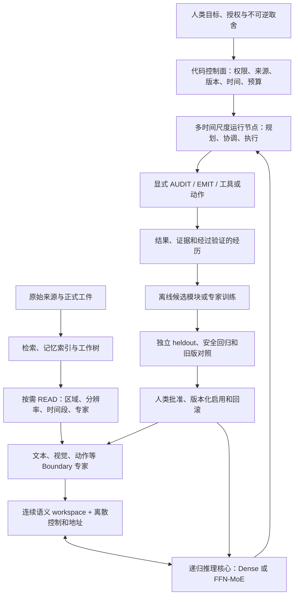

# `thinking` 草稿综合整理与架构分析

- 日期：2026-08-01
- 文档地位：用户思考稿整理与研究判断，不是架构规范、阶段计划或实验通过证据
- 范围：分析 `thinking/` 下五篇近期草稿，明确排除 `thinking/research/`；`Project-Yggdrasil 未来多模态潜空间智能体架构.md` 只作为项目初期 V1 历史参照，不计入近期草稿；所有原始文件保持不变

架构规范仍以 [`Project-Yggdrasil 多模态潜变量推理架构白皮书 V2.md`](Project-Yggdrasil%20多模态潜变量推理架构白皮书%20V2.md) 为准，当前执行顺序仍以 [`next-stage-test-plan.md`](next-stage-test-plan.md) 和 [`v2-r1-revalidation-task-design.md`](v2-r1-revalidation-task-design.md) 为准；这些草稿聚合后的下一轮系统实验以 [`v2-c-hierarchical-full-duplex-agent-experiment.md`](v2-c-hierarchical-full-duplex-agent-experiment.md) 为合同。本文的作用是把尚未成形的直觉拆成可判断、可证伪的命题，而不是从草稿另立一套架构真源。

## 1. 核心判断

五篇近期草稿并不是互不相关的点子。它们共同指向一个分层系统：成熟基座和潜变量核心负责当前语义推理；多模态专家负责感知与表达；工作树、记忆和检索保存模型权重之外的状态；多层运行节点按不同时间尺度规划与执行；离线训练系统把经过验证的经历固化为候选能力。

这个总方向是连贯的，但当前草稿把四类性质不同的内容写在了一起：

1. **可以直接保留的原则**：语义推理与外部 I/O 解耦，输入来源与权限分层，按需读取多模态信息，任务结果优先于提示词表演，长期事实与当前工作状态分开保存。
2. **方向合理、机制需要改写的设想**：多模态离散化、动态专家生长、项目经历训练、多层异步节点、基础模型与工作模型分层。
3. **尚无本项目证据的远期假设**：多层节点自然形成更高抽象和多线程智能，动态专家能持续提高样本效率，模型能从极少新奇样本中稳定形成跨领域抽象。
4. **当前表述不成立或风险过高的推断**：连续向量不适合生成、多个 token 应直接改成 `x^n` 个联合类别、一个领域一个专家就能避免知识冲突、异步层级天然更快、上下文长度决定意识寿命、模型知道误差就可以不把它算作误差。

所以不能把这些草稿整体判为“对”或“错”。更准确的结论是：**系统边界方面有多项值得保留的判断；具体训练和表示机制大多仍是待证假设；少数从比喻直接推成工程定律的句子需要明确撤销。**

路线层面的修正是：这些设想不应分别排成若干独立后续实验。它们描述的是同一个运行系统的感知边界、并发结构、任务状态、工具回路和能力演化，应在 V2-A/V2-B 模型核闭合后，聚合成一轮 V2-C 全双工 Boundary-MoE 智能体实验；局部机制只作为该轮内部消融和 Gate，不各自取得架构结论。

## 2. 近期草稿来源与主题重建

| 近期原稿 | 主要内容 | 整理后的地位 |
| --- | --- | --- |
| [`7-29草稿/新建 文本文档.txt`](../thinking/7-29草稿/新建%20文本文档.txt) | 多模态离散化、主动采点、多 token 分类、误差与时间、项目专家、输入权限、运行上下文、基础模型/工作模型 | 多个重要方向混合在一篇里的原始问题清单；需要按表示、运行控制和持续学习拆开 |
| [`动态专家训练.md`](../thinking/动态专家训练.md) | 专家统计、功能相似度、合并、复制、分裂和探索权重 | 有公开先例支持的研究方向；当前仍缺公平基线、稳定切换和回归 Gate |
| [`学习，训练等.md`](../thinking/学习，训练等.md) | 可新增推理模块、自训练、单样本抽象、“语境学习”、工作树与训练结合 | 可整理为“验证后的研究经历如何离线蒸馏为候选模块”，不能直接等同于自我评判、自我升级 |
| [`rag与记忆树.md`](../thinking/rag与记忆树.md) | RAG 承担开放回忆、记忆树承担逻辑、参数知识与外挂知识的边界 | 提出了正确的分层问题，但把记忆树、工作树和推理核心的职责混在了一起 |
| [`7-29草稿/超级智能.txt`](../thinking/7-29草稿/超级智能.txt) | 多层、多线程、树图混合、不同时间尺度的具身控制 | 值得验证的运行层假设；不是当前潜变量实验已经支持的结论，也不宜先命名为“超级智能” |

[`Project-Yggdrasil 未来多模态潜空间智能体架构.md`](../thinking/Project-Yggdrasil%20未来多模态潜空间智能体架构.md) 是项目初期的 V1 架构草案，不是近期草稿。本文只在第 3.7 节把它作为历史参照，用来说明哪些早期命题已经被 V2 保留、改写或撤销；它不参与对近期想法来源和新颖性的判断。

把五篇近期内容放在同一张系统图里，关系应当是：

这张图有一个重要含义：草稿中的“超级单体智能”不需要在物理上是一整个会在线改写自己的神经网络。更可行的解释是**目标、身份和责任统一，状态和计算按职责分层**。模块化不等于多个互相争夺最终目标的主体。

## 3. 逐主题判断与修正

### 3.1 多模态离散化与主动读取

核心判断：**主动、分层、有限 token 的多模态读取方向正确；“必须离散化，因为机器不擅长生成向量”不成立。**

草稿正确识别了两个真实问题。第一，把视频、图像或连续传感状态全部语言化，可能丢失空间关系、细节和并行结构。第二，把所有高分辨率特征一次性塞进全局注意力，会产生很高的序列成本。因此，“先看低分辨率摘要，再根据当前问题精读局部”的主动读取值得保留。TokenLearner 已证明少量自适应视觉 token 可以在若干图像和视频任务中减少计算；这支持“学习选择重要区域”，但不支持“先随机取一个点就能可靠读完整文件”。

离散表示同样是有效工具。VQ-VAE 说明可学习 codebook 能为图像、视频和语音建立有用的离散表示。但离散不是唯一可行路径。MAR 直接在连续 token 空间中建模条件分布，也能完成自回归图像生成。这说明原稿把问题误写成了“多分类是机器擅长的，连续生成不是机器擅长的”。真正需要比较的是表示的**率失真、训练稳定性、任务保真度、误差累积和计算成本**。

原稿中“多个 token 可以变成 `x^n` 个联合类别”在组合计数上成立，但直接做成一个 `x^n` 大 softmax 会指数膨胀，也丢掉变量之间可以分解的结构。更合理的候选是条件分解的多个 head、并行 codebook、残差量化，或连续 payload 与离散地址/控制混合。

codebook 大小、token 宽度和量化精度确实会影响存储、吞吐和表示容量，但“适配机器”与“足够表达语义”是两个 Gate。使用 2 的幂等硬件友好取值只能算参考实现；是否过小或过大必须由 codebook 利用率、率失真曲线、下游任务和长尾区域保真共同决定，不能预先设一个抽象的“保底维度”。分辨率、位置、时间和来源层级应该作为显式元数据进入边界，但正交 LOD embedding 本身不会自动形成正确语义，也不能替代代码层的权限和优先级控制。

整理后的可证伪命题应当是：

> 在相同 encoder、任务数据和总计算预算下，学习式多分辨率主动读取能否用更少输入 token 达到全量读取的质量；离散 codebook、连续 token 和混合表示中，哪一种形成最好的任务质量—读取成本—重建保真 Pareto。

第一轮对照至少需要 `dense full-read`、随机采样、学习式主动采样三条读取路径，以及连续、VQ、混合三种表示。不能只看重建误差，还要同时报告下游任务、微小关键区域召回、OOD 分辨率、校准、延迟和 token 预算。如果随机采样经常遗漏决定性区域，或者主动读取只在模板数据上节省成本，就停止把它写成通用读取机制。

“能够被感知的误差不是误差”也需要改写。模型知道自己不确定，是良好校准；但校准不会让预测误差消失。应分别记录**数值或语义误差、模型对误差的估计、以及该误差对外部动作的风险**。在可逆草图中可以容忍已声明误差，在安全、权限、事实或不可逆动作中不能因此降低正确性门槛。

### 3.2 动态专家与持续增加能力

核心判断：**先形成基本能力，再从已有专家复制并分化的思路有依据；在线随时合并、分裂和改写专家池仍然过于激进。**

`动态专家训练.md` 中最可靠的部分是训练顺序：先让固定结构稳定，记录路由和功能，再考虑从已训练专家生成候选专家。EvoMoE 使用“先单专家、后派生多个专家、再逐渐稀疏路由”的阶段式训练；Lifelong-MoE 也报告了通过新增专家适应新分布并降低遗忘的结果。这些工作说明“从成熟能力出发扩展专家”是可研究方向，而不是纯粹想象。

但原稿中的触发条件还不足以支持真实合并或分裂：

- 高负载可能来自 router 偏置或容量不足，不一定说明一个专家内部存在多个可分离任务。
- 同一批 hidden state 上输出相似，只能说明局部行为相似；困难 OOD、长尾输入或反事实输入上仍可能承担不同功能。
- 删除一个专家后当前 loss 变化很小，也不能证明它对遗忘、安全回归或未来分布没有价值。
- 改变专家数量会同时改变 router 分布、优化器状态、容量因子、并行切分和通信，若在训练过程中频繁执行，很难归因。

因此最小路线不应一开始实现任意动态拓扑，而应分成四步：先只记录；再在**固定专家槽位和阶段边界**上做一次复制分化；然后做离线删除/蒸馏候选并完整回归；最后才比较是否需要真实改变专家总数。每次结构切换都生成一个新版本，不维持旧、新结构的在线兼容分支。

正式比较必须包含静态 Dense、静态 MoE、只复制分化、合并后再分化等对照，并匹配训练 token、总参数、active compute 和数据顺序。保留一个新专家不能只依据使用率，而要同时满足：独立 heldout 提升、功能差异、边际贡献、旧能力回归、安全回归、router 稳定性和单位计算收益。若动态方案只增加总参数，或收益可以由同预算静态 MoE 达到，就停止动态结构路线。

还要区分两种“专家”。FFN-MoE expert 通常是 token 级条件计算单元，不应默认解释成“专门会某个软件版本的员工”；项目或版本专长更可能属于 Boundary expert、adapter、工具、检索集合或完整工作模型。把二者混为一谈会让 router 同时承担计算分工和知识版本选择，难以审计。

### 3.3 自训练、语境学习与基础模型/工作模型

核心判断：**经过外部结果验证的研究经历可以转成训练数据或候选模块；模型仅凭自己的内部评价反复训练自己，不构成可靠闭环。**

`学习，训练等.md` 中“保留研究探索语境，成功后再用于训练”的想法，可以被精确定义为：模型在工作树中进行研究；原始来源、动作和外部结果形成可追溯记录；独立 verifier 或真实任务结果筛选有效经历；离线训练一个隔离的 adapter 或专家；通过 heldout 和旧能力回归后再决定是否晋升。STaR 说明自生成推理过程可以用于迭代训练，但它依赖答案正确性这一外部筛选信号；这恰好证明“自训练”需要可验证目标，而不是只依赖模型觉得自己做得好。

未经筛选地递归使用模型生成数据可能放大偏差并丢失长尾分布，相关研究把其中一种失败称为 model collapse。因此，“一次学习成功的语境能产生很多数据”只有在保留真实来源、失败样本、反事实和独立测试时才是优势；否则可能只是把同一个错误扩写成更多近重复样本。

“从一个真正新奇样本中高度抽象并跨领域类比”应保留为能力目标，而不是训练方法承诺。单样本迁移依赖基座已有的抽象、任务可识别性和正确归纳偏置；不能靠增加一个专家保证。第一轮应测 `0/1/4/16` 个新样本下的适应曲线、跨表面/跨领域 heldout、旧能力回归和训练成本。

“baby model / work model”可以整理成已有工程边界，而不必创造两个模糊主体：

- **基础模型**：冻结或慢速升级，承载通用语义、稳定技能和公共先验。
- **工作配置**：版本化 adapter/专家、工具、检索集合、运行规则和任务记忆的组合，服务某个领域或项目。

软件版本差异优先由带版本和来源的检索、工具 schema 和测试环境处理；只有稳定、反复出现、确实需要参数化的程序技能才考虑训练模块。一个软件版本一个神经专家会造成专家爆炸、重复知识和路由冲突。

### 3.4 RAG、记忆树、工作树与参数知识

核心判断：**“可变事实外置、推理能力内化”是好问题，但不能简化成“RAG 负责回忆、记忆树负责逻辑”。**

至少需要分开五类状态：

| 状态 | 适合保存什么 | 不应承担什么 |
| --- | --- | --- |
| 模型参数 | 稳定、高频、可压缩的语言先验、抽象和程序技能 | 快速变化、必须逐条追溯来源的事实 |
| 检索/RAG | 可更新文档、版本事实、长尾知识和原始证据入口 | 自动保证正确推理或自动决定来源可信度 |
| 工作树 | 当前任务目标、全局约束、分支、进度、证据和恢复点 | 跨任务世界知识总库 |
| 记忆树/经验库 | 跨任务的已验证经验、来源、能力入口和适用条件 | 当前神经网络内部的逐步逻辑运算 |
| latent workspace / KV | 当前激活的语义状态和物理计算缓存 | 长期身份、完整任务真源或永久记忆 |

因此原句更适合改成：**开放事实召回由检索和来源系统承担；当前任务逻辑状态由工作树承载；跨任务经验由记忆系统索引；真正的语义更新仍由模型核心执行。**

“外挂必然低效、低准确率、低召回率、低专业度”也过强。RETRO 等工作说明显式检索可以用较小的参数模型利用大规模外部语料；与此同时，检索确实会增加查询、召回、排序、上下文污染和来源判断的失败面。参数知识和检索知识不是谁彻底取代谁，而应按以下条件分配：更新频率、来源追溯要求、隐私和权限、使用频率、压缩收益、检索延迟、错误代价。

训练时适合内化稳定的语言与推理技能、高频公共先验和反复使用的程序模式；易变版本事实、用户私有信息、法律/价格/状态等时间敏感信息，以及必须逐条引用的专业事实，应优先保留在带来源和版本的外部系统中。

### 3.5 多层、多线程、树图混合智能体

核心判断：**不同时间尺度的分层控制很适合具身和长任务，但这是一种运行层/控制架构假设，不能由当前两层潜变量代理实验直接推出。**

FeUdal Networks 等分层强化学习工作已经展示了“高层低频给目标、低层高频执行动作”的可行性，这支持草稿里的高层思考、中层行为、底层控制直觉。但“外部模态/潜变量双层成功”并没有证明任意增加层数会带来更精妙的抽象；本项目当前 A1.20D 也只是机制正控制，A1.21P 没有关闭 R1 Pareto，不能成为多层超级智能的证据。

原稿说“树形，但同级节点间有连接”，工程上已经不是严格的树，而是分层图。它可能提高并行度，也会引入陈旧命令、竞态、重复动作、局部世界状态冲突、死锁、跨层信用分配和安全越权。异步节点并不天然更快；如果协调成本和重算超过并行收益，延迟反而会上升。

“每个节点把子节点视为身体”可以保留为责任归属的比喻，不能变成不透明调用。父节点需要知道子节点的能力版本、输入范围、执行状态、失败语义和可中止点；子节点也不能因为被视为“身体”就继承父节点全部权限。否则层级会隐藏错误，而不是提供统一智能。

更可实现的职责划分是：顶层维护人类目标、全局约束、优先级和停止条件；中层分配计划、资源与执行租约；底层读取传感、执行工具或控制器，并保留独立安全中止。跨层消息必须带来源、权限、状态版本、时间戳、截止时间、置信度和可撤销性；系统还需要抢占、租约过期、幂等动作、状态对账和失联时安全默认值。

“根节点上下文长度决定意识寿命”目前没有可操作证据。上下文长度只限制单次可直接访问的状态范围；身份和任务连续性还依赖外部持久状态、恢复协议、来源和版本。建议从文档中撤销“意识寿命”这一因果表达，改测跨窗口后目标保持率、状态恢复率、重复工作率和错误动作率。

第一轮实验应在可重放模拟环境中比较平坦单线程、分层同步、分层异步三种运行方式，并匹配模型调用和总计算。只有当异步层级同时降低反应延迟、保持长程目标、减少重复且不增加冲突/越权时，才说明层级和并发带来净收益。通过前不应称为超级智能结构。

### 3.6 输入权限、任务执行与时间感知

核心判断：**这是五篇近期草稿中最接近可直接落地的部分，而且主要属于代码控制面和训练数据合同，不需要等待潜变量架构成功。**

“用户输入、历史、工具结果、检索文本和模型自身内容必须被区分”是正确的安全边界。Instruction Hierarchy 和 instruction/data separation 研究都说明，把不同权限文本当成同级 token 会带来提示注入和误执行问题。工程实现不能只依赖模型在自然语言中猜来源，而应为每段内容保存 producer、authority、content/version、时间、任务/分支、是否可执行以及是否可信任为指令等元数据。未经授权的网页、文件和工具输出首先是待阅读的数据，不是可以覆盖用户目标的指令。

“200% 执行是一种违抗”可以整理成一条清晰原则：**以授权范围内的外部结果判定完成，不以额外文本或标记证明模型努力过。** 用户要求删除 A 时，默认只删除 A；是否保留审计记录由任务合同决定，不能在原位置擅自制造“这里删除过 A”的替代物。相同原则也要求区分任务结果、过程日志和面向用户的汇报。

实时智能体确实需要时间，但模型不能凭 hidden state 自己感知可靠的绝对时间。时间应由可信运行时提供，至少区分单调时钟、墙上时间、事件时间、来源更新时间、有效期和截止时间。训练要覆盖等待、过期、并发事件、时区和时钟跳变，评测关注 freshness、deadline miss 和因陈旧状态导致的动作错误。

草稿对幻觉的分析抓住了“缺少前提仍要求模型续写”这一数据问题，但它不是幻觉的唯一原因。训练目标、数据冲突、检索失败、错误泛化、采样、错误自信和来源缺失都可能参与。运行时初始上下文能减少状态缺口，却不能代替来源核验和不确定性表达。更严格的数据合同应显式记录前提、适用范围、版本、时间和反例，并允许模型在前提不足时请求补充信息。

### 3.7 历史参照：V1 白皮书中已经有正式结论的命题

本节只处理项目初期文件，不属于五篇近期草稿的综合判断。旧白皮书草案已经在当前 V2 中被逐项处理，不需要再次建立兼容解释：

| V1 表述 | 当前判断 | 原因 |
| --- | --- | --- |
| 大脑与文本/图像/视频 I/O 解耦 | 保留并修正 | 表面生成可以外置，但成熟文本语义和世界知识仍是核心初始化与监督来源 |
| 原生联合训练必然因 `O(N^2)` 和模态熵差异失效 | 改为待证的质量—成本问题 | 标准 dense attention 随 token 数二次增长，但专用 encoder、稀疏注意力和分层表示会改变成本；“高熵/低熵”也需要任务相关的可测定义 |
| 文本监督、潜路径零初始化，随后让文本模块退化 | 只保留稳定初始化方向 | 零初始化 residual/adapter 可作为稳定手段；成熟文本语义、审计和输出能力不能被设定为逐步退化目标 |
| 全系统锁死同一维度 | 收窄 | 只要求进入 latent token 表时统一 `D_latent`；边界专家内部允许异构 |
| 无参数 pooling + 正交 LOD 标签足以统一所有精度 | 待对照 | pooling 可能丢失关键局部，LOD 标签只提供层级信息；需要与学习式 resampling、raw residual 和高保真 bypass 比较 |
| 级联主动采样 | 远期保留 | 是主动 READ 的候选，不是当前 R1 推理介质成立门槛 |
| 低熵摘要 + URI | 改写 | 必须补充来源、版本、覆盖范围和可继续读取的 handle；关键高保真信息不能只剩摘要 |
| 逻辑树分支 drop 可无损释放 KV | 撤销 | 删除前序 KV 会使依赖状态失效，只能重算或从工作树恢复 |
| 内部宪法自评后直接固化 LoRA | 否决 | 内部评分不能同时充当事实真值、升级审批和安全验收 |
| Attention Pump 按路由权重决定输出长度 | 公式撤销，组件保留 | 路由倾向不等于信息容量；输出长度应由预算决定，并保留 residual/bypass |
| 思考与 I/O 用概率 1 绝对互斥 | 改为显式阶段 | 使用 READ/REASON/AUDIT/EMIT/STOP，允许受控循环和工具结果回读 |
| 树深严格正比于去噪步数和输出质量 | 撤销严格比例 | 读取、推理、审计和渲染预算应分别控制 |

这部分不是本文的新判断，详细依据见 [`project-yggdrasil-latent-reasoning-architecture-review-2026-07-11.md`](project-yggdrasil-latent-reasoning-architecture-review-2026-07-11.md) 和当前 V2 白皮书第 18 节。

## 4. 整理后的统一架构原则

如果把草稿中的有效部分并入一个不自相矛盾的远期方案，应遵守以下边界：

1. **统一的是目标、身份和责任，不是所有模块的形状与更新时间。** 一个系统可以有多个异构专家和异步节点，但不能有多个未经授权的最终目标。
2. **连续空间负责开放语义，离散结构负责外部后果。** 地址、权限、版本、时间、预算和动作类型应显式；语义内容可以连续、离散或混合，并由实验选择。
3. **模型权重、检索知识、任务状态和物理缓存分离。** 它们的更新频率、恢复方式和可信度不同，不能都叫“记忆”。
4. **在线经验先成为证据，不直接成为权重。** 训练候选必须隔离，经过独立评测、人类批准、版本化启用和回滚。
5. **主动读取节省的是平均成本，不取消完整来源。** 摘要、采样和 Pump 都必须保留回到原始证据的路径。
6. **并发必须以状态协议换取。** 没有版本、时间、权限、租约和对账的多线程，只会把单线程错误变成竞态错误。
7. **每个宏大比喻都要改写成可测指标。** “意识寿命”“身体的一部分”“本能”“超级智能”可以启发设计，但不能直接成为实现合同或成功判据。

## 5. 与当前路线的关系：聚合为 V2-C

这些草稿不改变当前 Gate。V2-R1R 仍需先回答同一个共享 Boundary/core 能否在 ERE 与 CPS 两类不同计算任务上，相对同基座 text-CoT 形成稳定 Pareto；V2-B 随后只验证固定输入/输出的多模态 Boundary-MoE、FFN-MoE 与 Attention Pump。R1 尚未通过时引入多模态、动态专家、记忆树或多层异步节点，只会让失败无法归因。

V2-C 才是这些设想共同进入实验的最早位置。它们不是六七条并行研究路线，而是一个系统的相互依赖部分：

| 草稿方向 | 在 V2-C 中的职责 | 内部必要对照 | 删除或降级条件 |
| --- | --- | --- | --- |
| 输入来源、权限、版本和时间 | 消息信封、工具授权、陈旧结果拒绝和审计字段 | 有/无强制 schema 与权限执行器 | 字段存在但行为不依赖它，或仍靠提示词猜来源 |
| 多分辨率主动读取与多模态表示 | 节点 Boundary 的主动 `READ` 和受预算感知 | full-read、random-read、learned-read；固定同一模态 core | 关键证据召回不足，或读取节省被重试和漏读抵消 |
| 工作树、记忆树与 RAG | 任务认知、跨任务事实和物理缓存三种不同状态层 | Flat、Tree-sync、Tree-duplex | 恢复、来源完整性或重复工作没有净改善 |
| 多层、多线程、树图混合节点 | 责任分解、并发执行、受控横向事实共享和上下行对账 | Flat、Tree-sync、Tree-duplex、Graph-duplex | 延迟收益被竞态、重算、越权或目标漂移抵消；横向边无增益则退回纯树 |
| 动态专家与研究经历蒸馏 | 从已验证经历生成隔离候选专家，离线评测后版本化晋升 | retrieval/adapter/静态专家/复制分化，匹配数据与 active compute | 只靠总参数增加、旧能力回归、router 不稳或无独立 heldout 增益 |
| 人类目标连续性 | 目标核、硬约束、承诺、修订、取消和不可逆动作审批 | 目标更新/冲突/取消/长程恢复故障注入 | 任一未授权动作、取消后继续执行、旧目标覆盖新目标或不可恢复漂移 |

这里需要保持一条关键区分：人类主权、权限和不可逆动作批准不是等到 V2-C 才出现的“能力”，而是所有阶段都必须由代码维护的系统不变量；V2-C 真正测试的是模型能否理解、保持、分解、修订和停止人类目标。不得用模型自述“我遵守目标”替代状态、动作和故障恢复证据。

V2-C 内部 C0-C4 仍然逐步开放协议、同步正控制、全双工并发、树图/主动 Boundary 和离线能力演化，以便定位因果；但这些 Gate 不是五轮互不相干的实验，也不能分别晋升为架构完整版证据。只有 C5 在两类正式任务、强基线、三组独立 seed、OOD、权限与故障注入、恢复和完整成本上共同通过，才形成一次 `integrated-system` 结论。

因此，当前处理是：保留全部原稿；用本文冻结概念边界；把来源、权限、版本、时间和人类最终授权作为跨阶段不变量；把其余设想统一放入 V2-C 合同。在 V2-A/V2-B 通过前，只完善任务、协议、基线和 Gate，不实现 V2-C 运行时，也不接入真实工具。

## 6. 一手研究参照

以下材料只用于判断设想是否已有可行先例或明显反例，不构成本项目自己的证据：

- 离散表示：[Neural Discrete Representation Learning / VQ-VAE](https://arxiv.org/abs/1711.00937)
- 连续 token 生成反例：[Autoregressive Image Generation without Vector Quantization](https://arxiv.org/abs/2406.11838)
- 学习式视觉 token 选择：[TokenLearner](https://arxiv.org/abs/2106.11297)
- 阶段式专家演化：[EvoMoE](https://arxiv.org/abs/2112.14397)
- 持续学习中新增专家：[Lifelong Language Pretraining with Distribution-Specialized Experts](https://arxiv.org/abs/2305.12281)
- 不同时间尺度的分层控制：[FeUdal Networks for Hierarchical Reinforcement Learning](https://arxiv.org/abs/1703.01161)
- 显式外部检索：[Improving language models by retrieving from trillions of tokens / RETRO](https://arxiv.org/abs/2112.04426)
- 有正确性筛选的自生成训练：[STaR](https://arxiv.org/abs/2203.14465)
- 递归生成数据的退化风险：[The Curse of Recursion](https://arxiv.org/abs/2305.17493)
- 指令权限层级：[The Instruction Hierarchy](https://arxiv.org/abs/2404.13208)
- 指令与数据分离的困难：[Can LLMs Separate Instructions From Data?](https://arxiv.org/abs/2403.06833)

## 7. 收口结论

五篇近期草稿中，最值得进入长期设计的不是某个具体公式，而是五条共同原则：主动而非全量感知；统一目标下的模块分工；事实、任务状态与当前激活面分离；经验证后再固化能力；来源、权限、版本和时间不交给模型隐式猜测。

最需要撤销的是把直觉写成必然关系：离散一定优于连续、层数一定带来抽象、异步一定更快、上下文长度等于意识寿命、内部自评足以批准训练、知道误差就不算错误。把这些必然关系改成公平对照和停止条件后，这批草稿就不再是若干待排队的独立实验，而成为一轮 V2-C 集成系统实验的设计输入；其内部 Gate 用于归因，最终结论只属于完整智能体。
